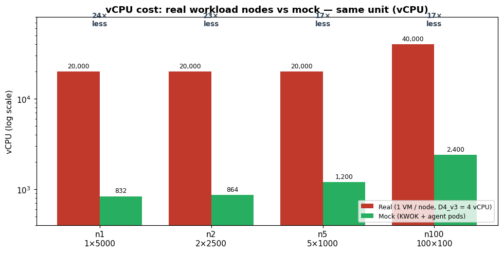
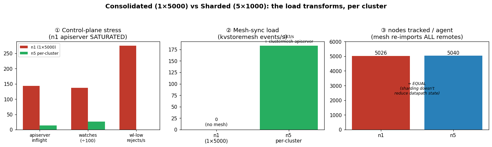

# ClusterMesh Scale Testing — Report

**Status:** draft · **Scope:** real-cluster scenario testing + the mock (KWOK) scale framework + the consolidated-vs-sharded experiment
**Data:** Prometheus snapshots in Azure Storage (`cmshscaleprom`) — see [Data & reproduction](#14-data--reproduction)

---

## 1. TL;DR

We built and validated a way to **scale-test AKS + ACNS ClusterMesh at 5k–10k nodes without paying for 5k–10k worker VMs**. Real workload nodes are replaced by **KWOK virtual nodes** and each node's Cilium agent by a **forked "mock" cilium agent** (real control plane, fake datapath). This runs the *real* Cilium/Fleet/ClusterMesh control plane at a fraction of the vCPU (~10×+ reduction).

On top of it we ran a **consolidated-vs-sharded experiment** (the same 5 000-pod workload spread across 1 / 2 / 5 / 100 clusters) and **proved the core ClusterMesh sharding tradeoff**:

> Sharding a fixed workload across meshed clusters **distributes the Kubernetes control-plane load** (each apiserver goes from *saturated* to *relaxed*) but **does not reduce the Cilium datapath load** — the mesh re-imports every remote cluster's state into every cluster — and it **adds a mesh-sync layer** (clustermesh-apiserver + kvstoremesh). **Sharding buys scalability, not efficiency.**

---

## 2. Motivation

A faithful ClusterMesh scale test at, say, 100 clusters × 100 nodes (10 000 nodes) would need **10 000 real worker VMs** — tens of thousands of vCPU, huge cost, and long provisioning. Most of what we want to measure, though, is **control-plane and mesh behavior** (identity/endpoint propagation, kvstoremesh throughput, apiserver load, convergence) — none of which needs a real datapath on the workload nodes.

**Idea:** mock out the two expensive things:
- **The nodes** → KWOK virtual nodes (free API objects, no VM).
- **The per-node Cilium agent** → a forked cilium binary in **DryMode** (real control-plane logic, no BPF/datapath), one lightweight Pod per virtual node.

The real AKS control plane, the real ACNS Cilium agents on the (few) real nodes, real Azure Fleet, and real ClusterMesh all stay in place.

---

## 3. Framework architecture

```
Real AKS cluster (managed control plane: apiserver, etcd)
 ├─ ACNS: real Cilium agents (k8s-app=cilium) on the few REAL nodes
 ├─ Fleet ClusterMesh: real clustermesh-apiserver + kvstoremesh (per cluster)
 └─ MOCK layer (provision-kwok-layer.sh):
      ├─ KWOK controller  → materializes N virtual Nodes (label type=kwok, taint kwok.x-k8s.io/node=fake)
      ├─ N × mock-cilium-agent Pods (app=mock-cilium-agent, --identity-allocation-mode=crd, DryMode)
      └─ workload Pods scheduled onto the KWOK nodes (fake datapath)
```

- **mock-cilium-agent**: forked cilium, real control-plane state (CiliumNode, CiliumEndpoint, identities, ClusterMesh consume), **no datapath**. Footprint **~9 m CPU / 56 Mi mem** each (measured via `kubectl top`).
- **Deploy layer** (`scenarios/perf-eval/clustermesh-scale/mock/provision-kwok-layer.sh`) is AKS-specific (reads cilium-config, node affinity); the agent fork is platform-agnostic.

### vCPU cost — real vs mock (same unit)

A *real* scale test needs **one VM per node**; the mock replaces each node's VM with a lightweight agent **Pod** (~9 m CPU) packed onto a thin real pool. Comparing like-for-like in **vCPU** (real = 1× Standard_D4_v3 = 4 vCPU/node, a modest AKS node):

| Tier | Nodes | Real (1 VM/node) | Mock (agent pool) | Reduction |
|------|-------|------------------|-------------------|-----------|
| n1 (1×5000) | 5 000 | 20 000 vCPU | **832 vCPU** | **24×** |
| n2 (2×2500) | 5 000 | 20 000 vCPU | **864 vCPU** | **23×** |
| n5 (5×1000) | 5 000 | 20 000 vCPU | **1 200 vCPU** | **17×** |
| n100 (100×100) | 10 000 | 40 000 vCPU | **2 400 vCPU** | **17×** |

Mock pools: n1 = 25×D32_v3; n2/n5 = 7–13×D32_v3 + 1×D16 (prom) per cluster; n100 = 2×D8_v3 + 1×D8 per cluster. The vCPU we spend is for the **agent Pods**, not the nodes — and the saving grows with real-node size.



---

## 4. Backend setup

- **Clusters:** AKS, **Azure CNI Powered by Cilium** (`network-plugin=azure`, `network-dataplane=cilium`), **pod subnet** (dynamic IP allocation, *not* overlay), **ACNS** enabled, `max-pods` 110–250, `service-cidr 192.168.0.0/24` (overridden on shared VNet to avoid overlapping `10.0.0.0/8`).
- **Mesh:** **Azure Fleet ClusterMesh** — one `ClusterMeshProfile` (`mesh=true` selector), members = clusters. Fleet deploys `clustermesh-apiserver` (+ its own etcd + kvstoremesh) to each member.
- **VNet topology:** **shared VNet** (`10.0.0.0/8`, per-cluster subnets, **zero peerings**) for all tiers — uniform, and mandatory at n=100 (peering = N·(N−1) is infeasible). Pod-to-pod is native L3.
- **Node pools:** a thin default pool hosts the mock-agent Pods; a dedicated `prometheus=true` pool hosts CL2's per-cluster Prometheus.
- **Pipeline:** the Azure/telescope `New Pipeline Test` (per-tier stages), region **eastus2euap** (EUAP, where ACNS/Fleet preview lives), subscription `37deca37…` (~5 000 Dv3 quota).

---

## 5. Scenarios (the workloads)

CL2 (ClusterLoader2) scenarios under `modules/python/clusterloader2/clustermesh-scale/config/`. Workload shape is *namespaces × deployments × replicas* Pods; the first `GLOBAL_NAMESPACE_COUNT` namespaces get the `clustermesh.cilium.io/global` annotation so their Services/identities/endpoints sync cross-cluster (we run **100 % global density**). Each Pod create/delete produces a CiliumEndpoint + identity that must **propagate across the mesh** — that propagation is what most scenarios stress. At the comparison scale (§9) the fixed workload materializes as **5 000 CiliumEndpoints** (1/Pod), **≈1 000 CiliumIdentities** (≈1 per Deployment — each Deployment's pods carry a unique `app` label), and **1 000 global Services** — every one imported into *every* peer cluster.

Every Deployment is created with a **paired Service** (a Deployment+Service object bundle), so **Services = Deployments = namespaces × deployments/ns**, and at 100 % global density every one is a *global* Service (it syncs mesh-wide). The **default per-cluster shape** each scenario deploys (its smoke/default `CL2_*` params) is:

| Scenario | ns | dep/ns | rep/dep | Deployments | Services | Pods | Extra objects |
|---|--:|--:|--:|--:|--:|--:|---|
| event-throughput | 5 | 4 | 10 | 20 | 20 | 200 | rolling-restart burst |
| pod-churn-combined | 5 | 4 | 10 | 20 | 20 | 200 | scale cycles + kill loop |
| pod-churn-kill | 5 | 4 | 10 | 20 | 20 | 200 | delete 5 pods / 10 s |
| pod-churn-scale | 5 | 4 | 10 | 20 | 20 | 200 | scale 0↔N ×5 |
| isolation | 5 | 4 | 10 | 20 | 20 | 200 | kill loop in 1 cluster |
| apiserver-failure | 5 | 4 | 10 | 20 | 20 | 200 | kill clustermesh-apiserver |
| node-churn (comb/replace/scale) | 5 | 4 | 10 | 20 | 20 | 200 | node lifecycle churn |
| upper-bound | 5 | 4 | 10 | 20 | 20 | 200 | QPS 100→10 000 rungs |
| policy-scale | 5 | 1 | 4 | 5 | 5 | 20 | + 50 CNP/ns = **250 CNPs** |

These are the **defaults** (used by the smoke stages); the consolidated-vs-sharded tiers in §9 override them to much larger counts. (`propagation-probe` is intentionally excluded — it's a **probe, not a scaled workload** (see §6): per cluster it deploys only a fixed tiny http-echo backend of **1 ns · 1 Deployment · 2 pods · 1 global Service** and measures a **single transient source pod per probe**, so it never grows with the tier.) Behaviour of each:

- **event-throughput** — *How fast can the mesh propagate object changes?* Deploys the workload (5 ns × 4 dep × 10 rep = 200 Pods/cluster, all global), warms up, then fires a **rolling-restart burst** — **one full rolling-restart of all 20 Deployments (all 200 Pods)** (`RESTART_GENERATION=1`) rate-limited to `API_SERVER_CALLS_PER_SECOND=20` — measuring cross-cluster **event/operation throughput + latency** (kvstoremesh) as the ~200 endpoint/identity changes propagate. Answers: sustainable and peak cross-cluster event rate.

- **pod-churn-combined** — The main churn workload. Deploys the workload, then runs two patterns back-to-back on it: **Phase A** deterministic scale cycles (scale every deployment 0↔N, ×5, 60 s each way — **10 full-workload replica swings**) and **Phase B** a random **kill loop** (delete 5 random Pods every 10 s for 600 s — **≈300 deletions** — while ReplicaSets recreate them). Measures convergence + mesh-sync cost under sustained churn. `pod-churn-kill` / `pod-churn-scale` are the two halves in isolation.

- **node-churn-combined / replace / scale** — Node-lifecycle churn driven by a host-side `node-churner.sh` (defaults, tunable): **scale** = **3 cycles of ±5 nodes** (add 5, remove 5 each cycle → 15 adds + 15 removes), **replace** = drain + `az vmss delete-instances` on a **batch of 10** VMSS instances, which refill as fresh VMs with **new IPs**, **combined** runs scale then replace. CL2 holds a steady 200-Pod workload and gathers the mesh's reaction to node membership/IP changes. *(In mock this must churn KWOK `Node` objects, not VMSS.)*

- **isolation** — Blast-radius test. Runs a heavy kill loop in **one** target cluster (**delete 5 random Pods every 10 s for 600 s ≈ 300 deletions**) while peers sit idle for the same window, then compares resource/latency metrics **target vs peers** to confirm a churning cluster doesn't destabilize its mesh peers.

- **apiserver-failure** — Mesh control-plane resilience. With a steady workload + global Services, **hard-kills the `clustermesh-apiserver` Pod once** on a target cluster, records t0→t1, and waits for the replacement Pod to reach Ready (≤240 s recovery timeout) — does cross-cluster state survive and recover a mesh-apiserver restart, and how fast?

- **policy-scale** — NetworkPolicy scale. Deploys a small backend, creates **50 CiliumNetworkPolicies/namespace (250/cluster)**, holds, deletes. Measures **policy implementation/regeneration latency** and endpoint/BPF pressure as CNP count grows. The CNP is permissive L4 — it exercises policy *compilation/distribution*, not allow/deny.

- **upper-bound** — Ceiling finder. Runs increasingly aggressive **rungs** (event QPS `100→10 000`, restart bursts `1→15`), each for a fixed duration with per-rung measurements, to locate where the mesh/control-plane saturates.

Measurement modules gathered: `control-plane`, `cilium`, `clustermesh-metrics`, `clustermesh-throughput`, `etcd-metrics`, `pod-churn-stress`, `node-churn`, `apiserver-failure`.

---

## 6. Probe suite (mesh-behavior probes)

Host-side orchestrators (bash, not CL2 `Exec`) that hold **all** clusters' kubeconfigs and time cross-cluster **propagation / recovery** behavior directly against the real Cilium agents.

- **propagation-probe** — *The headline latency probe.* Creates a source Pod in one cluster, waits for its IP, then polls **every peer cluster's real Cilium agent** (`cilium-dbg bpf ipcache list`, `identity list -o json`, CiliumEndpoint CRDs) and times how long the new Pod's **IP / identity / CEP** takes to appear in each peer = end-to-end mesh propagation latency. Optional variants add a peer-side `curl` to the global Service (connectivity), removal timing, and first-packet.

- **mesh-detach-rejoin** — Membership-change latency. Uses `az fleet member update` to relabel a victim cluster **out** of the mesh, re-applies the ClusterMeshProfile, and polls the remaining clusters' `cilium-dbg status` (`ClusterMesh: X/Y remote clusters ready`) to time how long peers take to notice the **detach** and then the **rejoin**.

- **mesh-failover** — Datapath reroute latency. Snapshots a victim's backend Pod IPs, confirms peers hold them in their **BPF LB maps**, scales the victim's backends to 0, then polls peers' LB maps until those IPs disappear = how fast the mesh reroutes away from dead backends. *(Real datapath.)*

- **mesh-policy-propagation** — Fleet-wide policy latency. Creates a unique CNP, applies it to all clusters **in parallel**, and polls each cluster's `cilium-dbg policy get` to time per-cluster apply + policy-loaded latency across the fleet.

- **mesh-recovery** — Agent-recovery latency. Snapshots peer ipcache, **kills a target cluster's cilium-agent Pod**, then polls for peer ipcache to diverge (stale entries) and re-converge once the new agent is up = how fast the mesh heals after an agent loss.

- **mesh-restart-survival** — Connection survival. Launches peer `curl`-loops hitting a global Service every second, **restarts the victim's clustermesh-apiserver**, and computes the fraction of requests that kept succeeding through the restart = do established cross-cluster connections survive a mesh control-plane restart? *(Real datapath.)*

---

## 7. Mock-compatibility matrix ⭐

The mock framework has a **real control plane but no datapath** on workload nodes (KWOK + DryMode agents). The rule: **control-plane / mesh-state behavior is faithful; anything that needs real packet forwarding, service load-balancing, or policy *enforcement* is not.**

| Scenario / Probe | Mock-compatible | Why |
|---|:--:|---|
| event-throughput | ✅ | pure control-plane / mesh-state event churn |
| pod-churn (combined/kill/scale) | ✅ | control-plane pod-lifecycle & identity/endpoint churn |
| isolation | ✅ | resource-isolation across control planes (no traffic) |
| apiserver-failure | ✅ | clustermesh-apiserver recovery (control-plane) |
| upper-bound | ✅ | control-plane saturation sweep |
| node-churn (combined/replace/scale) | ⚠️ **adapt** | churns **real VMSS** instances; mock uses KWOK nodes → must churn KWOK `Node` objects instead |
| policy-scale | ⚠️ **partial** | CNP *propagation/compile* metrics ok-ish; DryMode agent does **no BPF enforcement**, so implementation/enforcement latency isn't real |
| **propagation-probe** | ⚠️ **partial** | IP/identity/CEP **state propagation** ✅ (reads real ACNS agents); **connectivity curl** ❌ (KWOK pods have no datapath) |
| mesh-detach-rejoin | ✅ | Fleet membership / remote-cluster readiness (mesh-state) |
| mesh-recovery | ✅ | ipcache/identity re-sync + agent readiness (mesh-state) |
| mesh-policy-propagation | ⚠️ **partial** | policy presence/propagation ✅; enforcement/impl-delay ❌ (no BPF) |
| **mesh-failover** | ❌ **no** | reads peer **BPF LB maps** / real service load-balancing |
| **mesh-restart-survival** | ❌ **no** | measures real cross-cluster **curl connections** surviving |

**So:** the state/propagation and control-plane-load scenarios port cleanly; the two datapath probes (`mesh-failover`, `mesh-restart-survival`) and the enforcement/connectivity portions of others must stay on **real clusters**.

---

## 8. Metrics reference

The full propagation/throughput signal reference is **[`MESH-METRICS.md`](./MESH-METRICS.md)** (co-located in this folder): the agent's view of remote clusters (`job=cilium`, `:9962`); **kvstoremesh** — the propagation engine (`:9964`) — its event/operation throughput & latency, API rate limiter → etcd, and StateDB; the labels you'll see everywhere; a per-metric sample query; and the snapshot query windows. Read it as the "how to read the data" companion to this report.

Key mesh-cost signals used in §10: `cilium_clustermesh_remote_cluster_nodes` (fan-out), `cilium_clustermesh_remote_clusters`, `cilium_clustermesh_global_services`, `cilium_nodes_all_num` (per-agent node awareness), `cilium_kvstoremesh_kvstore_events_*` (propagation throughput/latency), and `apiserver_flowcontrol_*` (control-plane saturation).

### 8.1 Telemetry coverage audit

Build 73076's snapshots predate the telemetry-completeness changes below. They remain the source for the published 10k results, but their missing families cannot be reconstructed after the fact.

| Source / component | Build 73076 | New-run collection path | Persistence |
|---|---|---|---|
| kube-apiserver request/APF/watch/storage | ✅ complete (`job=master`) | unchanged CL2 Prometheus scrape | per-cluster TSDB snapshot |
| KSM object state/inventory | ✅ 177 `kube_*` names | unchanged (`scrape_ksm=True`) | per-cluster TSDB snapshot |
| Cilium / mock-agent / clustermesh / kvstoremesh | ✅ | unchanged PodMonitors | per-cluster TSDB snapshot |
| **real-node kubelet + cAdvisor** | ❌ absent | mock mode now loads an early `real-node-kubelet` PodMonitor. It uses the real Cilium DaemonSet as a one-pod-per-real-node discovery anchor, rewrites each target to `hostIP:10250`, and scrapes `/metrics` + `/metrics/cadvisor`. KWOK nodes never become targets. | per-cluster TSDB snapshot |
| **AKS-managed apiserver CPU/memory** | ❌ | aggregate percentages from AKS platform metrics + per-backend CPU/RSS from the `apiserver-backend-exporter`, which fingerprints HA replicas by `process_start_time_seconds` | native CL2 snapshot + reconstructed managed TSDB |
| **AKS etcd server health/DB/leader** | ❌ | full `controlplane-etcd` metrics (minimal ingestion disabled) + aggregate CPU/memory/DB utilization from AKS platform metrics | persistent AMW + reconstructed managed TSDB |
| **scheduler / controller-manager** | ❌ | full `controlplane-kube-scheduler` + `controlplane-kube-controller-manager` functional metrics | persistent AMW + reconstructed managed TSDB |
| **KWOK pod/node CPU-memory** | ❌ | KWOK `ResourceUsage`/`Metric` CRDs expose explicitly synthetic container/pod/node usage to Prometheus and metrics-server | native CL2 snapshot |

Every future CL2 run writes `telemetry/telemetry-audit-self-hosted.{json,md}` before snapshot/teardown. The pipeline artifact carries them beside the TSDB tarball; blob storage keeps them under a separate `telemetry-audit-self-hosted/` prefix so the snapshot-folder invariant (**blob-count = cluster-count**) stays true. The opt-in AKS control-plane canary also writes `telemetry-audit-managed.{json,md}` plus a run manifest containing the AMW, query window, enabled targets, cluster ARM IDs, and run-unique alphanumeric Prometheus cluster aliases (`<run_id>_<role>`, punctuation normalized to `_`). Missing required families are warnings (the workload result is preserved) but are explicit in the published audit.

The managed path is intentionally separate from the native TSDB snapshot: AKS control-plane endpoints cannot be scraped reliably by self-hosted Prometheus, and AMW has no `/admin/tsdb/snapshot` or `remote_read`. Raw control-plane series therefore stay in the persistent AMW. For offline use, the pipeline enumerates every metric name, exports fixed-step PromQL matrices, merges all available AKS platform metrics, and backfills native Prometheus blocks with `promtool`. This reconstructed tarball is queryable but not lossless: exact scrape timestamps, staleness markers, exemplars, and native histograms cannot be recovered.

**Hard AKS boundaries:** managed control-plane scrape configs intentionally drop `go_*` and `process_(cpu|max|resident|virtual|open)_.*` before customer keep-lists. Scheduler/controller-manager CPU-memory and per-replica etcd CPU/RSS are therefore not customer-visible. API server per-replica CPU/RSS is recovered separately by the backend-fingerprinting exporter; etcd CPU-memory remains aggregate-only.

The full scheduler/controller metric sets still provide defensible **busy-time lower bounds**, not actual process CPU: `rate(scheduler_scheduling_attempt_duration_seconds_sum[5m])` for the scheduler and `sum(rate(workqueue_work_duration_seconds_sum{job="controlplane-kube-controller-manager"}[5m]))` for controller handlers. Queue depth/duration and unfinished-work metrics complete the saturation story. No defensible RSS reconstruction exists for these hidden processes.

---

## 9. Experiments — consolidated vs sharded

The **same total workload (5 000 pods)** is spread across a varying number of meshed clusters. Every tier fixes `deployments/ns = 2` and `replicas/deployment = 5`; only the **sharding** (clusters × per-cluster size) changes. Nodes/cluster = `MOCK_NODE_COUNT` (one mock-cilium-agent per node). Main workload = `pod-churn-combined` (the sharded tiers also run a cold `propagation-probe` first).

| Tier | Clusters | Nodes/cl | ns/cl | dep/ns | rep/dep | Deploy/cl | Svc/cl | Pods/cl | Mesh |
|---|--:|--:|--:|--:|--:|--:|--:|--:|---|
| **n1** | 1 | 5 000 | 500 | 2 | 5 | 1 000 | 1 000 | 5 000 | **none** (baseline) |
| **n2** | 2 | 2 500 | 250 | 2 | 5 | 500 | 500 | 2 500 | 2-cluster |
| **n5** | 5 | 1 000 | 100 | 2 | 5 | 200 | 200 | 1 000 | 5-cluster |
| **n100** | 100 | 100 | 5 | 2 | 5 | 10 | 10 | 50 | 100-cluster (10 000 nodes) |

**Mesh-wide totals are held constant across all four tiers**: **500 namespaces · 1 000 Deployments · 1 000 global Services · 5 000 Pods · 5 000 CiliumEndpoints · ≈1 000 CiliumIdentities · 100 % global density** — only how they shard changes. n1 (no mesh) is the consolidated baseline; n5 is the sharded end; n100 inverts the load entirely onto the mesh fabric (50 pods/cluster but 10 000 nodes and 99 remote peers each).

---

## 10. Results — the load tradeoff (n1 vs n5)

Measured at peak churn from the pod-churn snapshots (n5 shown per-cluster). Both tiers verified clean (n1 converged 99.6 %, n5 100 % across all 5 clusters).

**Structural (obvious):** nodes/cluster 5 026 → 1 008; apiserver req/s **174 875 → 16 524**.

**① Control-plane stress (the ceiling-setter):**

| | n1 (1×5000) | n5 (per cluster) |
|---|---|---|
| apiserver inflight | 143 | 14 |
| apiserver watches (longrunning) | 13 736 | 2 585 |
| p99 latency (non-watch) | 180 ms | 110 ms |
| **workload-low rejects** | **275/s, sustained 100 % of the run** | **~0** |

→ n1's single apiserver is **saturated** (rejecting workload-low continuously) — the single-cluster ceiling. Sharding relaxes it ~10×.

**② Mesh-sync load (n5 only — n1 has none):** kvstoremesh **183 events/s + 177 kvstore ops/s per cluster**; a `clustermesh-apiserver` HA pair per cluster.

**③ Resource:** control-plane RSS 5.6 GiB (n1) → 1.7 GiB/cluster but **8.3 GiB total** (≈1.5× *more* mesh-wide); mock-agents equal mesh-wide (5 000 either way).

**④ Propagation latency (n5, clean):** kvstoremesh **operation-duration P95 = 40–210 ms** — the mesh-sync step itself is **sub-second**; **remote-cluster failures = 0** (per-peer median increase 0, no propagation errors); probe-pod startup **p50 ≈ 6.5 s** (create→ready, ~5 s of it scheduling). So end-to-end *apply → visible-in-peer* is dominated by **pod startup**, not mesh sync. *(Source: CL2 `ClusterMeshKvstoreOperationDurationP95` + `PodStartupLatency` measurements, build 73002.)*

**The key non-obvious finding:** `cilium_nodes_all_num` per agent = **5 026 (n1) ≈ 5 040 (n5)**, and mesh-wide `Σ` is **identical (25.3 M)** — the mesh **re-imports every remote node into every cluster**, so sharding does *not* reduce per-agent datapath state.

**Conclusion:** sharding **transforms** the load (saturated single apiserver → distributed relaxed apiservers **+ a mesh-sync layer + more total resource**) — **scalability, not efficiency.**



### 10.1 At the extreme — the 10k tier (100×100) at 100 % density

Build **73076** is the first **clean 100 % global-density 10k run**: 100 clusters × 100 KWOK nodes = **10 000 nodes**, 50 pods/cluster (5 000 mesh-wide), `pod-churn-combined`. Fleet converged all **100/100** clustermesh-apiservers on its own (~41 min), the mock layer (10k nodes + 10k mock-agents) came up, and the workload ran **100/100 clusters clean** — only 2 clusters hit *transient* apiserver blips (`failed to get cluster version` / `server unable to handle request`), soft-failed, data still captured. The per-agent figures below were **verified on two independent clusters** (mesh-1, mesh-50); every cluster is identical.

| Signal (per agent, @100 % density) | 100×100 |
|---|---|
| remote clusters / agent | **99** (all peers) |
| nodes tracked / agent (`cilium_nodes_all_num`) | **~10 300** — the *entire* mesh (~103 local + ~10 200 remote) |
| global services / agent | **10** (same-named services, merged mesh-wide) |
| agents / cluster | **~103** |
| kvstoremesh op-duration p95 / p99 | **~20 ms / ~190 ms** |
| kvstoremesh sync throughput / cluster | **~69 events/s + ~57 api-limiter req/s** |
| apiserver inflight / APF rejects / cluster | **2–6 / 0** (~17 k req/s, mostly lease+watch chatter) |

**Findings (10k, standalone):**

- **Total node awareness — sharding *globalizes* node state.** Every one of the ~10 300 agents imports the *whole* 10 000-node mesh, so mesh-wide there are ≈ **106 million node-tracking relationships** (~10 300 agents × ~10 300 nodes). Splitting the fleet into 100 clusters did **not** localize node state; it made every agent aware of every node.
- **All-to-all watch fabric.** ~103 agents/cluster × 99 remotes ≈ 10 200 agent→remote-cluster watches per cluster → ≈ **1.0 million** mesh-wide. This is the dominant scaling term, and it grows as N².
- **Services merge by name, not by cluster.** The 10 same-named services on each cluster collapse into **10 mesh-wide global services**, each load-balancing ~**500 backends** (100 clusters × 5 replicas). Cross-cluster service identity is by namespace/name.
- **The k8s control plane is featherweight per cluster.** apiserver inflight **2–6**, **0 APF rejects**; the ~17 k req/s is dominated by lease/node/watch chatter from 100 nodes + agents, not queuing. No single apiserver is stressed — the entire cost lives in the **mesh fabric**.
- **Sync stays cheap even at full fan-out.** With 99 peers and the full node import, kvstoremesh operations still complete at **p95 ~20 ms** — the propagation engine is not the bottleneck at 10k.
- **The wall is mesh *formation*, not steady state.** Once formed, the 10k mesh runs cleanly (pod-churn 100/100). The limiter is **Azure Fleet deploying 100 clustermesh-apiservers**, which wedges ~75 % of the time (3 of the last 4 n=100 runs stalled at ~30–35/100 with the rest never created; §11). This is why the framework now ships a **surgical batched member re-join** recovery (§11) — steady-state mesh operation at 10 000 nodes is comfortable; getting Fleet to *form* the mesh is the hard part.

### 10.2 Propagation latency — measured numbers

Two different signals measure "how fast does a change propagate", at two very different layers:

**(a) End-to-end `apply → visible-in-peer`** — the `propagation-probe` (§6): create a pod in cluster A, poll every peer's real Cilium agent until the pod's IP appears in its BPF ipcache. This is the user-facing latency. *(Direct per-probe timings are host-side JSONL, stored in Kusto — not in the Prometheus snapshots.)*

| Setup | `apply → peer-ipcache` | Notes |
|---|---|---|
| 2×50 mock, idle | **33–38 s** | matches real-cluster baseline (~35 s) |
| 2×300 mock, idle | **~43 s** median (37/38/43/51/52) | |
| 2×300 mock, **under load** (600 global endpoints churning) | **56–69 s** | **propagation degrades under load** (~1.3–1.6×) |

The dominant term is **pod startup + poll granularity** (tens of seconds), and it's **load-sensitive** — the mesh sync queue backs up under concurrent churn, which is exactly the effect the scale tiers stress. `t_peer_identity` is set on every probe; `t_peer_cep = 0` because a remote pod's CiliumEndpoint is *not* a peer CRD — it lives only in the peer agent's kvstore-sourced ipcache/identity state (see §12).

**(b) kvstoremesh operation duration** — the mesh-sync step itself (etcd read/write/lease behind the propagation), the Prometheus proxy that **is** in the snapshots (`cilium_kvstoremesh_kvstore_operations_duration_seconds`, query in [`MESH-METRICS.md`](./MESH-METRICS.md)):

| Tier | op-duration p95 | remote-cluster failures |
|---|---|---|
| n5 (5×1000, build 73002) | **40–210 ms** | 0 |
| n100 (100×100, build 73076) | **~20 ms** | 0 |

**These measure different things**: (a) is end-to-end object visibility (**tens of seconds**, dominated by pod lifecycle); (b) is the mesh's internal sync operation (**tens of milliseconds**). The mesh's own propagation engine is fast and clean even at 10k; the user-visible latency is dominated by pod startup and is the part that degrades under load.

---

## 11. Findings & fixes

- **APF / kwok-controller readiness fix.** At ≥2 500 nodes/cluster the churn workload flooded the apiserver's `workload-low` API-Priority-and-Fairness class; `kwok-controller`'s pod/node-status writes (also `workload-low`) got starved → ~40 % of pods stuck *Running-but-NotReady*. **Fix:** a dedicated APF `FlowSchema` + `PriorityLevelConfiguration` for the `kwok-controller` SA. Validated live: `workload-low` took ~5 700 rejects while kwok-controller had **0** and all nodes converged.
- **Fleet ClusterMesh flakiness.** `clustermesh-apiserver` deploy is non-deterministic at scale: clean at n≤20, but at **n=100 only ~35/100 apiservers deployed** (a Fleet wedge). Auto-recovery (delete+recreate the CMP) is **counter-productive at n=100** — it tears down the working apiservers and recovers none (should be gated off above small N).
- **Telemetry gap — per-component CPU/mem.** `scrape_kubelets=False` in mock mode (KWOK nodes have no kubelet → Prometheus readiness timeout) also disabled **cAdvisor**, so the container CPU/mem measurements returned empty. **Implemented for the next run:** keep CL2's binary all-node job off, but load a pre-readiness PodMonitor that discovers only real nodes through their Cilium DaemonSet pods and scrapes kubelet/cAdvisor at `hostIP:10250`. This avoids creating even transient KWOK targets.
- **Telemetry gap — API server per-replica CPU/RSS.** Direct `/metrics` contains process counters, but a normal Prometheus job corrupts the counter by bouncing across HA backends. A lightweight exporter now makes fresh authenticated requests, fingerprints replicas by `process_start_time_seconds`, and exposes stable per-backend CPU/RSS series. A live six-backend probe measured ~0.15–0.22 cores and ~532–639 MB RSS per backend.
- **Telemetry gap — KWOK usage.** Virtual pods have no real process usage, but KWOK's `ResourceUsage`/`Metric` API can expose explicitly synthetic container/pod/node CPU-memory. The path was validated through both Prometheus node discovery and metrics-server (`kubectl top`).
- **Telemetry gap — AKS-managed control plane.** Self-hosted Prometheus cannot reliably scrape the hidden AKS control-plane replicas. An opt-in n=2 canary now attaches every run cluster to one persistent AMW, enables every supported cluster/control-plane target with minimal ingestion disabled, exports all available AKS platform metrics, and builds a queryable reconstructed TSDB tarball. The live local proof captured 1 678 managed metric names with zero query errors and produced a 12 MB offline snapshot. **Pipeline canary validation is still required.**

See **[`clustermesh-scale-failure-modes.md`](./clustermesh-scale-failure-modes.md)** for the fuller catalogue of failure modes (Fleet flakiness, apiserver shedding, the 10k wedge, etc.).

---

## 12. Limitations & mock fidelity

**Faithfully reproduced:** real Cilium control-plane logic, real Fleet/ClusterMesh, real `clustermesh-apiserver` + kvstoremesh, real CiliumIdentity/Endpoint churn, real apiserver/etcd load, real cross-cluster **state** propagation.

**NOT reproduced:** the **datapath** — no real packet forwarding, no service load-balancing, no NetworkPolicy **enforcement**, no real connectivity. Results about *control-plane scale and mesh cost* are valid; results about *connectivity/enforcement* are not (use real clusters — see the matrix).

**Other limits:** historical snapshots still lack the new telemetry; KWOK usage is synthetic by definition; scheduler/controller-manager CPU-memory and per-replica etcd CPU/RSS are intentionally unavailable through AKS customer APIs; reconstructed AMW snapshots cannot preserve exact scrape timestamps/staleness/exemplars/native histograms; n=100 Fleet reliability is fragile.

---

## 13. Validation status

| Item | Status |
|---|---|
| n1 (1×5000) | ✅ clean run + snapshot (build 72937) |
| n5 (5×1000) | ✅ clean run + snapshot (build 73002) |
| n2 (2×2500) | ⚠️ **needs clean rerun** — 72973 had mesh-2 stall at 45 %; 73029/73030 reruns failed |
| n100 (100×100) | ✅ **clean 100 % density run** (73076: 100/100 apiservers, pod-churn 100/100 clusters) — Fleet self-converged; surgical-rejoin recovery added for the ~75 % wedge case |
| APF fix | ✅ validated live |
| consolidated-vs-sharded (n1 vs n5) | ✅ proven |
| real-node kubelet/cAdvisor scrape | ✅ build 73451: 3/3 kubelet + 3/3 cAdvisor real-node targets up on both clusters; container CPU-memory verified |
| API server backend CPU/RSS exporter | 🧪 local six-backend probe + mock exporter smoke passed; pipeline canary pending |
| KWOK synthetic CPU-memory | 🧪 local Prometheus + metrics-server smoke passed; pipeline canary pending |
| AKS managed control-plane metrics | 🧪 dedicated live AKS+AMW proof passed; pipeline canary pending |
| reconstructed managed TSDB export | 🧪 1 678 metrics / 5.59 M samples / 12 MB tar loaded successfully; pipeline canary pending |
| automated telemetry coverage audit | ✅ self-hosted artifacts validated in build 73451; etcd histogram-family false negative fixed locally. Managed pipeline artifact validation pending |
| AKS control-plane/audit logs | 🧪 all supported diagnostic categories wired to persistent resource-specific Log Analytics tables; full-telemetry stage pending |

---

## 14. Data & reproduction

**Prometheus snapshots — Azure Storage.** All tier snapshots live in storage account **`cmshscaleprom`**, container **`snapshots`** (RG `clustermesh-scale-prom-snapshots`, sub `37deca37…`, region eastus). Access is **Entra-ID only** — shared-key and public access are disabled, so you need the **`Storage Blob Data Reader`** role on the account (ask the owner). Layout: `clustermesh-scale-2/<scenario>/<buildId>-<rg>/prom-snapshot-<cluster>-<ts>.tar.gz` — one blob per cluster, so **blob-count = cluster-count = tier**.

| Tier | Blobs | Container folder |
|---|--:|---|
| **n1** 1×5000 (baseline, clean) | 1 | `pod-churn-combined/72937-6d786c8e/` |
| **n5** 5×1000 (sharded, clean) | 5 | `pod-churn-combined/73002-a692b14e/` (+ `propagation-probe/73002-a692b14e/`) |
| **n2** 2×2500 (sharded, **NOISY — do-not-use**) | 2 | `pod-churn-combined/72973-ba735658/` |
| **n100** 100×100 (10k, **100 % density, clean**) | 96 | `pod-churn-combined/73076-72713705/` (+ `propagation-probe/73076-72713705/`, 97) |
| n100 100×100 (older, 20 % density) | 97 | `pod-churn-combined/72210-72713705/` |

**Download a tier** (Entra-ID auth; grabs all clusters of the tier at once):
```bash
az login
az storage blob download-batch --account-name cmshscaleprom --auth-mode login \
  --source snapshots --destination ./n5 \
  --pattern "clustermesh-scale-2/pod-churn-combined/73002-a692b14e/*"
```
List everything: `az storage blob list --account-name cmshscaleprom --container-name snapshots --auth-mode login -o table`.

**Load a downloaded tier:** `run-local-prom-native.sh <tarball> <port>` (single cluster) or `prom-server.sh import <tarballs…>` (consolidated — query all clusters together). New snapshots bake `run`, `build`, `tier`, and `snapshot_cluster` into every native TSDB series before upload, so overlapping runs and clusters remain independently queryable without overwriting metric-native labels such as Cilium's `source_cluster`. Data is historical, so query with explicit `time=`/windows. (A local convenience copy also lives under `~/prom-snapshots/cmp-5k/`.)

The largest real n1 snapshot rewrite (6.07 million series, 27.25 million chunks, 3.4 GB expanded) completed in 5m09s with 1.66 GB peak RAM. The clean n100 pod-churn plus propagation snapshots total 5.64 GB compressed. Snapshot staging uses hard links instead of a second full copy, and uploaded native tarballs are removed before managed TSDB reconstruction.

**Dashboards:** `grafana.sh start` → http://localhost:3000.

**Run a tier:** trigger the `New Pipeline Test` stage for the tier (UI, subscription `37deca37…`, region eastus2euap); results + Prometheus snapshots auto-upload to the `cmshscaleprom` container above (and as pipeline artifacts).

**Self-hosted telemetry audits (new runs):**

```
clustermesh-scale-2/telemetry-audit-self-hosted/<scenario>/<run_id>/
  telemetry-audit-self-hosted-<role>.json
  telemetry-audit-self-hosted-<role>.md
```

**AKS control-plane metrics (new-run canary).** The n=2 mock smoke is the opt-in rollout stage. On its first run it registers the subscription preview feature, creates/reuses Azure Monitor workspace `cmsh-scale-eastus2euap-amw` in persistent RG `clustermesh-scale-prom-snapshots`, and attaches both AKS clusters. The workspace is deliberately outside the ephemeral run RG, so its raw Prometheus data survives cleanup. Audit artifacts are uploaded beside the snapshots at:

```
clustermesh-scale-2/managed-control-plane/<run_id>/
  run-manifest.json
  telemetry-audit-managed.json
  telemetry-audit-managed.md
  aks-platform-<role>.json
  aks-platform-<role>.openmetrics
  control-plane-log-summary.json
  control-plane-log-sample-<role>.json
  amw-export-manifest.json
  prom-snapshot-amw-<timestamp>.tar.gz
```

Query the retained workspace directly (the AMW API requires an exact metric-name matcher):

```bash
ENDPOINT=$(az monitor account show \
  --resource-group clustermesh-scale-prom-snapshots \
  --name cmsh-scale-eastus2euap-amw \
  --query properties.metrics.prometheusQueryEndpoint -o tsv)
TOKEN=$(az account get-access-token \
  --resource https://prometheus.monitor.azure.com \
  --query accessToken -o tsv)
curl -fsS -G "$ENDPOINT/api/v1/query_range" \
  -H "Authorization: Bearer $TOKEN" \
  --data-urlencode 'query=up{job="controlplane-etcd",cluster="<run_id>_mesh_1"}' \
  --data-urlencode 'start=2026-07-13T00:00:00Z' \
  --data-urlencode 'end=2026-07-13T01:00:00Z' \
  --data-urlencode 'step=15s'
```

Both the native per-cluster TSDB and reconstructed AMW TSDB include a queryable `clustermesh_cluster_identity_info` series. Its labels preserve the run ID, mesh role, AKS cluster name, full ARM resource ID, subscription ID, resource group, region, and run-unique managed-Prometheus alias. Every reconstructed AMW block also receives constant `run`, `build`, and `tier` labels through `promtool`; native blocks additionally receive `snapshot_cluster` through a bounded streaming rewrite that externally sorts series, copies encoded chunk records byte-for-byte into the new order, and remaps tombstones without decoding samples. Overlapping time-range blocks still produce a Prometheus startup warning, but their series identities are disjoint and can be selected with `{run="…"}` and `{tier="…"}` without one run masking another. The run manifest retains the same mapping alongside the exact start/end window. AMW `/query_range` supports at most 32 days; `/series` supports at most 12 hours, so the automated inventory audit caps its series window while the raw retained data remains complete.

The pipeline exposes managed collection as separate tasks in one job: bounded ingestion wait, audit/log/platform export, AMW TSDB reconstruction, and blob upload. This preserves the same output directory and manifest while making long reconstruction work visible and allowing partial artifacts to upload if a later phase fails.

**Control-plane/audit logs.** The full-telemetry stage creates/reuses Log Analytics workspace `cmsh-scale-controlplane-law` in `eastus2`, then dynamically enables every diagnostic log category advertised by each AKS cluster in resource-specific mode. This includes kube-apiserver, kube-audit, kube-audit-admin, scheduler, controller-manager, autoscaler, cloud-controller-manager, guard, CSI, Fleet and Karpenter categories when available. The full raw stream remains in `AKSControlPlane`, `AKSAudit`, and `AKSAuditAdmin`; pipeline artifacts contain run-window counts and a bounded 5 000-row sample per cluster.

---

## 15. Appendix — key knobs

`CL2_NAMESPACES`, `CL2_GLOBAL_NAMESPACE_COUNT` (100 % = all), `CL2_DEPLOYMENTS_PER_NAMESPACE`, `CL2_REPLICAS_PER_DEPLOYMENT`, `CL2_CHURN_CYCLES`, `CL2_KILL_DURATION_SECONDS/INTERVAL/BATCH`, `CL2_PROPAGATION_PROBE_*`, `CL2_KWOK_USAGE_CPU`, `CL2_KWOK_USAGE_MEMORY`, `MOCK_NODE_COUNT`, `MOCK_MESH_STRIDE`, `MOCK_DEPLOY_MAX_FAILURES`, `CMP_AUTO_RECOVERY_ENABLED`, `AKS_CONTROL_PLANE_METRICS_ENABLED`, `AKS_CONTROL_PLANE_METRICS_REGISTER_PREVIEW`, `AKS_CONTROL_PLANE_AMW_RESOURCE_GROUP`, `AKS_CONTROL_PLANE_AMW_NAME`, `AKS_CONTROL_PLANE_LAW_NAME`, `AKS_CONTROL_PLANE_LOG_RETENTION_DAYS`, `AKS_PLATFORM_METRICS_TIMEOUT_SECONDS`, `AKS_CONTROL_PLANE_LOGS_TIMEOUT_SECONDS`, `AKS_MANAGED_TSDB_*`.

**Values used** — *comparison tiers*: `DEPLOYMENTS_PER_NAMESPACE=2`, `REPLICAS_PER_DEPLOYMENT=5`, `NAMESPACES`=500/250/100/5 (n1/n2/n5/n100), `GLOBAL_NAMESPACE_COUNT=NAMESPACES` (100 %); *churn*: `CHURN_CYCLES=5`, `CHURN_UP/DOWN_DURATION=60s`, `KILL_BATCH=5`, `KILL_INTERVAL_SECONDS=10`, `KILL_DURATION_SECONDS=600`; *timing*: `WARMUP_DURATION=30s`, `HOLD_DURATION=2m`, `API_SERVER_CALLS_PER_SECOND=20`; *probe*: `PROBE_COUNT=20`, interval `30s`, `PROBE_WINDOW_DURATION=30m`. Smoke stages use the larger per-scenario defaults (`DEPLOYMENTS_PER_NAMESPACE=4`, `REPLICAS_PER_DEPLOYMENT=10`).

Per-tier tfvars: `scenarios/perf-eval/clustermesh-scale/terraform-inputs/azure-{1-mock-5k,2-mock-2500,5-mock-1000,100-mock-shared}.tfvars`.
