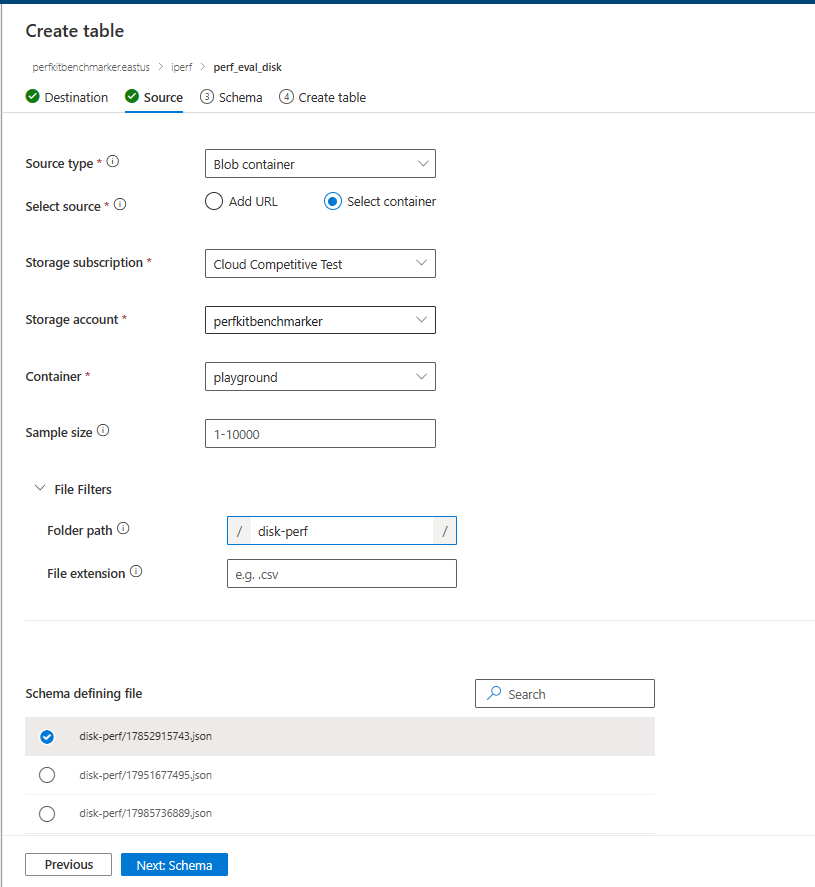
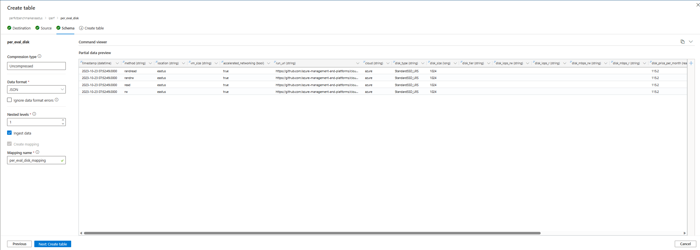
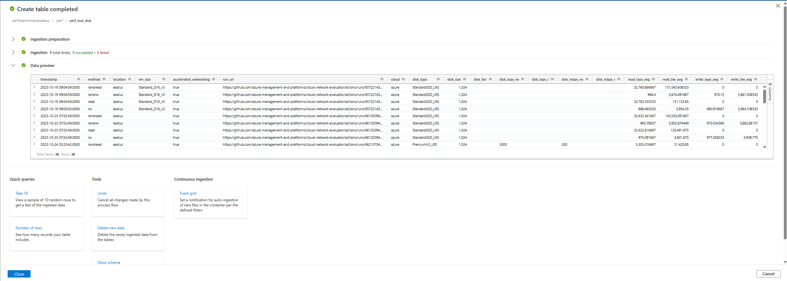
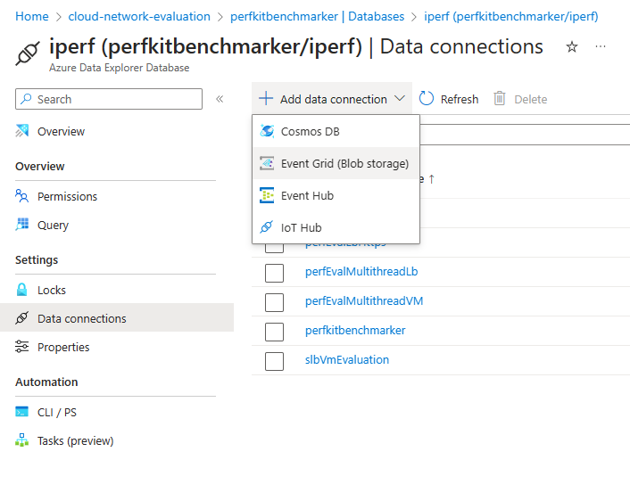
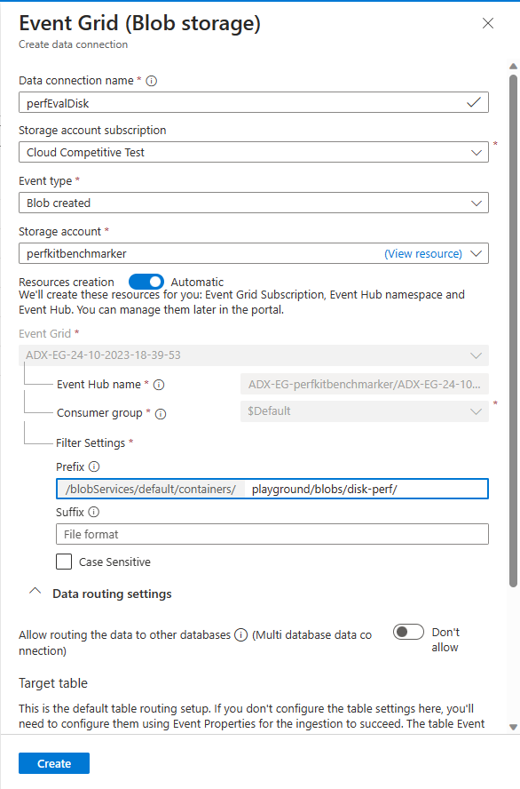
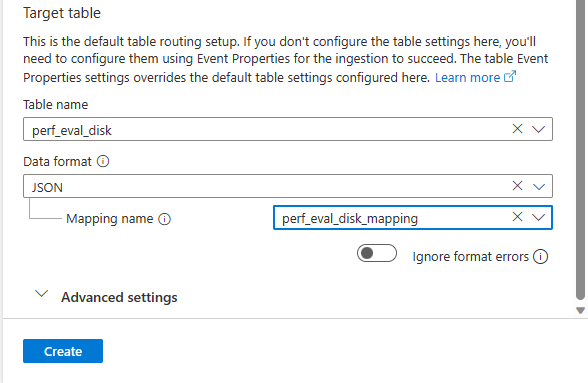

## Create Data Connection from Azure Storage Account to Azure Data Explorer

This guide covers how to publish test results: upload test result files as json blob to storage account, and ingest test results into data explorer database tables

### Step 1: Create table in the database

- When uploading a blob to a container in the storage account, make sure you add a subfolder name before the name of the result file to distinguish results from different test scenarios. 

For example:

```
source_file_name=/tmp/17852915743/result.json
subfolder_name=disk-perf
destination_file_name=17852915743.json

az storage blob upload \
    --file $source_file_name \
    --name ${subfolder_name}/${destination_file_name} \
    --account-name $AZURE_STORAGE_ACCOUNT_NAME \
    --account-key $AZURE_STORAGE_ACCOUNT_KEY \
    --container-name $AZURE_STORAGE_CONTAINER_NAME
```

- Once you have some sample blobs uploaded to storage account, create a table in data explorer database. Remember to fill in the **Folder path** in the **File Filters** section with subfolder name (e.g. disk-perf) to filter and ingest the correct blob data.
- In **Schema defining file** section, choose the blob with the most desirable format to use for data mapping. 



- In **Schema** tab, you will get an overview of what the table will look like. You can easily rename columns and change the data type. You can even add new columns if necessary. 



- The table will be created based on the Schema and all existing sample blobs will be ingested at the time of creation.



### Step 2: Create data connection

We will create data connection using Event Grid (Blob storage). It's crucial that you create the data connection **immediately** after the table is created to avoid new blobs not getting ingested properly.

- Go to the database in which you just crate a table, click on **Add data connection** and choose **Event Grid (Blob storage)**.



- We will choose **Blob created** as the *Event Type*
- For *Resources creation*, use **Automatic** option. 
- In *Prefix* section, remember to fill in the container name and subfolder name where your blobs live. This is required to prevent the table from ingesting all blobs in the container by default. 

In this example, *playground* is the container name and *disk-perf* is the subfolder name)



- Remember to match the *Data format* with the one you chose when creating the table. Afterwards, the automatically created mapping will show up for you to choose. 



Once completed, any new test result file uploaded to the storage account as json blob will be automatically ingested to the data explorer table. 