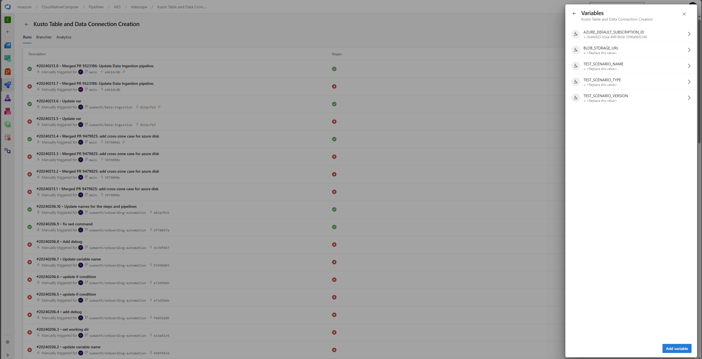
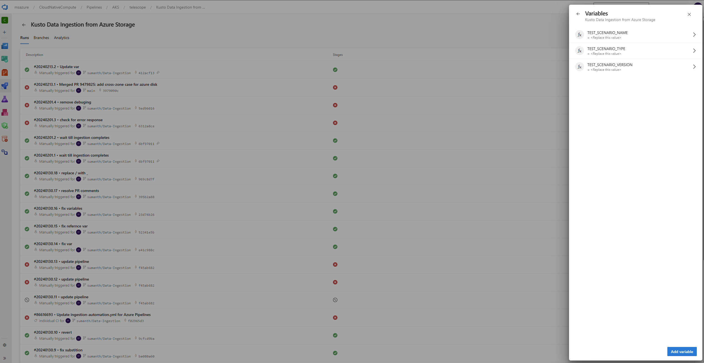

# Data connection and Data Ingestion Automation Pipelines

## Summary about pipelines
You can use these pipelines to run the automation for creating kusto tables, event hub instances, subscriptions and data connections to ingest data into kusto from azure storage containers.

# Data connection and Tables creation:
Pipeline - [Runs for Kusto Table and Data Connection Creation (visualstudio.com)](https://msazure.visualstudio.com/CloudNativeCompute/_build?definitionId=342761&_a=summary)

Steps and inputs to run this pipeline:
- Go to the pipeline page.
- Select Run Pipeline button to run this pipeline.

- Update variables based on your test scenario
Example:
    SCENARIO_TYPE: perf-eval
    SCENARIO_NAME: vm-iperf
    SCENARIO_VERSION: v.1.0.10
    BLOB_STORAGE_URL:https://akstelescope.blob.core.windows.net/perf-eval/vm-iperf/v1.0.10/2020fc0e-e9e2-54b6-36c6-d5f60b56d1f9-84511069.json

- Click on Run to create the data connections and tables based on the result data from storage account.

- [Successful pipeline run](https://msazure.visualstudio.com/CloudNativeCompute/_build/results?buildId=87481748&view=results)

# One time Data ingestion:

Pipeline -[Runs for Kusto Data Ingestion from Azure Storage (visualstudio.com)](https://msazure.visualstudio.com/CloudNativeCompute/_build?definitionId=345697)

Steps and inputs to run this pipeline:
- Go to the pipeline page.
- Select Run Pipeline button to run this pipeline.

- Update variables based on your test scenario
Example:
    SCENARIO_TYPE: perf-eval
    SCENARIO_NAME: vm-iperf
    SCENARIO_VERSION: v.1.0.10

- Click on Run to create the data connections and tables based on the result data from storage account.

- [Successful pipeline run](https://msazure.visualstudio.com/CloudNativeCompute/_build/results?buildId=87483539&view=logs&j=36a08b4a-8fb0-5483-406c-cef72de14512&t=8680e7ae-c3d4-5dab-593a-979ba4750c3a)