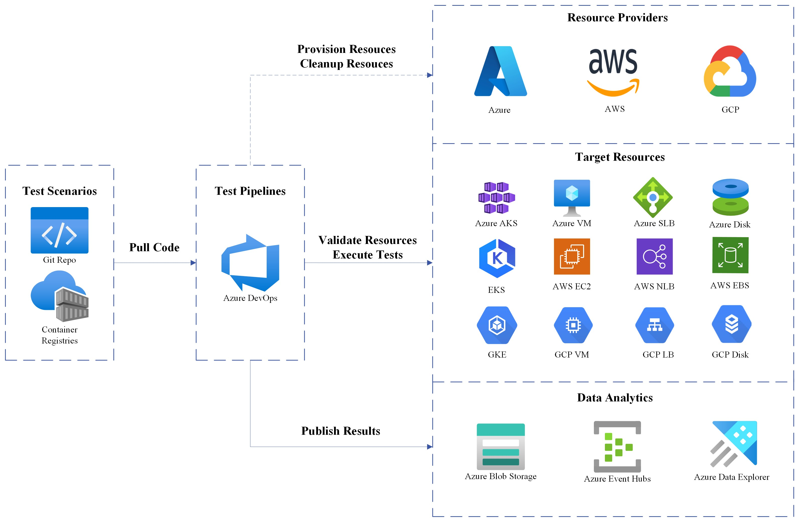

# Design

## Achitecture

As the achitecture diagram above shows, Telescope streamlines the evaluation process through five key steps:

1. Provision Resources
2. Validate Resources
3. Execute Tests
4. Cleanup Resources
5. Publish Results

The framework consists of three main re-usable components:
1. **Terraform Modules** (`modules/terraform/`) - Cloud infrastructure provisioning
2. **Python Modules** (`modules/python/`) - Test tools integration and execution
3. **Pipeline Templates** (`pipelines/`, `jobs/`, `steps/`) - Pipelines for test automation
  
# Implementation

## Components

### Pipelines

The [pipelines](../pipelines/) orchestrate steps to run to conduct the benchmarking. The pipelines are to be run in Azure Devops (ADO) using ADO syntax in YAML format.

### Scenarios

The [scenarios](../scenarios/) contains the scenarios for each test case, focusing on a particular setup. analogically each scenario is an test case corresponding to `SCENARIO_NAME` used in the pipeline definition.

### Steps

The [steps](../steps/) folder contains reusable templates to be invoked from the pipeline. the steps are organized in a functional way, such as to setup/cleanup infrastructure, setup other resources / testing framework etc.

### Modules

The [modules](../modules/) contains the tailored code to be invoked from the steps. There are two main parts:

- python: python functions to integrate test engines/tools
- terraform: cloud agnostic way to setup test targets/resources

Python code is the entrypoint to test tools such as [clusterloader2](https://github.com/kubernetes/perf-tests/blob/master/clusterloader2/docs/GETTING_STARTED.md)

## Tools

The framework integrates with these performance testing tools:
1. [kperf](https://github.com/Azure/kperf/pkgs/container/kperf) - API server and ETCD performance testing
2. [kwok](https://github.com/kubernetes-sigs/kwok) - Kubernetes simulation without kubelet
3. [clusterloader2](https://github.com/kubernetes/perf-tests/blob/master/clusterloader2/) - Kubernetes cluster performance testing
<<<<<<< HEAD
4. [resource-consumer](https://github.com/kubernetes/kubernetes/blob/master/test/images/resource-consumer/README.md) - Resource utilization testing
=======
4. [resource-comsumer](https://github.com/kubernetes/kubernetes/blob/master/test/images/resource-consumer/README.md) - Resource utilization testing
>>>>>>> 3781963a (Update docs for vibe coding)
5. [iperf](https://github.com/esnet/iperf) - Network performance testing
6. [fio](https://github.com/axboe/fio) - Storage I/O performance testing

CL2 (clusterloader2) uses its own [template engine](https://github.com/kubernetes/perf-tests/blob/master/clusterloader2/README.md#object-template). For benchmarking purpose, the metrics is collected through prometheus and measurement defined by [PromQL](https://prometheus.io/docs/prometheus/latest/querying/operators/). There are CL2 [out of box measurements](https://github.com/kubernetes/perf-tests/blob/master/clusterloader2/README.md#Measurement) and customised [kubelet measurement](../modules/python/clusterloader2/cri/config/kubelet-measurement.yaml). The metrics to collect are [kubernetes metrics](https://kubernetes.io/docs/reference/instrumentation/metrics/) and the measurements are usually [SLOs](https://github.com/kubernetes/community/blob/master/sig-scalability/slos/slos.md) and other key performance [SLIs](https://kubernetes.io/docs/reference/instrumentation/slis/).
