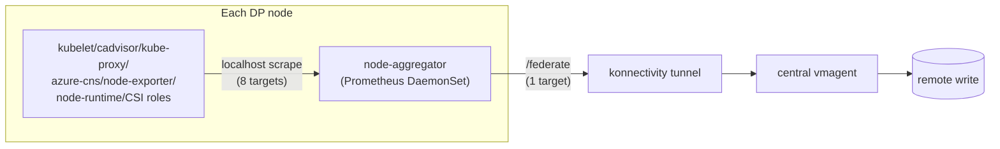

[[_TOC_]]

# VMAgent Node-Aggregator: Design Proposal & Load-Test Report

_A proposal to replace today's 8-scrapes-per-node direct-scrape design with a per-node aggregator
that pre-collects and federates metrics locally, so central vmagent and the konnectivity tunnel each
handle one target per node instead of eight. Backed by repeated A/B load tests (500-2,000 simulated
nodes) comparing the two designs on identical infrastructure, with results cross-validated across
multiple independent runs._

## TL;DR

- **The problem**: for every DP node, central vmagent today opens 8 separate scrape round-trips
  through the konnectivity tunnel (6 real-target roles + 2 CSI DaemonSet roles). Each round-trip is
  its own tunnel dial, its own connection, and its own load on konn-server/konn-agent.
- **The proposal**: run a real, unmodified Prometheus as a DaemonSet on every node. It scrapes all 8
  roles locally over `localhost` (no tunnel needed) and exposes one federated endpoint. Central
  vmagent then scrapes **one** target per node instead of eight.
- **The payoff**: consistently, across every independent test run, this cuts central remote-write row
  volume by roughly **42-70%**, konn-server memory by **~70%**, and established tunnel connections by
  **8-17x** — with zero observed dial errors on the aggregator side vs. real errors seen on the
  direct-scrape baseline.
- **The cost**: a new, permanent per-node footprint (roughly **110-150MB memory, well under 0.02
  CPU cores** per node) for running the local Prometheus — this is the central trade-off to weigh
  before shipping it broadly.
- **Status**: the design is prototyped and repeatedly validated on the load-test harness; it now
  also scopes itself to only the nodes actually in the central scrape scope (rather than running
  unconditionally everywhere), closing the main gap from earlier rounds. See Next Steps for what's
  still open.

## Background: why the direct-scrape design is expensive

Today's production design has central vmagent dial each DP node individually, once per role:

- 6 real-target roles: kubelet, cadvisor, kube-proxy, azure-cns, node-exporter, node-runtime.
- 2 CSI DaemonSet roles: csi-azuredisk-node, csi-azurefile-node.

Every one of those 8 scrapes is a separate round trip through the konnectivity tunnel: vmagent's
scrape request goes to konn-server, which picks a konn-agent, which dials the target on the node.
That means **8 established connections, 8 dials, and 8 independent request/response cycles per node**
just to collect metrics that mostly live on the same node already. At fleet scale this multiplies
directly with node count: konn-server and konn-agent both carry connection/dial load that scales
8:1 against the number of nodes actually being monitored, and central vmagent's own service-discovery
and scrape-scheduling work scales the same way.

## Design: how the node-aggregator works

- **node-aggregator** is a real, unmodified Prometheus running as a DaemonSet
  (`manifests/node-aggregator.yaml`) — not a custom or modified binary. It scrapes all 8 roles
  **locally**, over `localhost` (`hostNetwork: true`), exactly the way a real node-level daemon
  would, and applies the same metric_relabel_configs/keep-filters the central config already uses.
- It exposes a combined view of all 8 roles through Prometheus's real `/federate` endpoint.
- Central vmagent scrapes **one** endpoint per node — the node-aggregator's `/federate` — through
  the konnectivity tunnel, instead of 8 separate endpoints.
- The DaemonSet is scoped with a node affinity that mirrors central vmagent's own scrape scope (the
  same mechanism prod uses to gate scraping by node count/subscription mode), so it only runs on
  nodes that are actually in scope — not unconditionally on every node in the fleet.

### Why this saves cost, component by component

- **Konnectivity server + agent**: the tunnel now carries 1 dial/connection per node instead of 8.
  Established connections and dial counts drop by roughly an order of magnitude (8-17x observed),
  which directly reduces konn-server's connection-tracking memory/CPU and konn-agent's dial/stream
  load. Fewer dials also means fewer opportunities for dial/stream errors under load.
- **Central vmagent**: service discovery and scrape scheduling now track 1 target per node instead
  of 8 — less SD churn, fewer scrape cycles to manage, and (via `vmagent-proxy`, the tunnel-dialing
  client side) fewer concurrent dials competing for tunnel capacity. Dial latency and error rate
  both improve because there's simply far less concurrent dial pressure on the tunnel.
- **Remote-write pipeline**: node-aggregator's local Prometheus applies the same relabel/keep-filters
  the central config uses before federating, so the volume of samples that actually reach central
  vmagent (and get remote-written) drops — observed consistently as a 42-70% reduction in ingested
  rows, not just a connection-count improvement.
- **The trade-off**: none of this is free — a full Prometheus instance now runs on every in-scope
  node, with its own memory/CPU footprint and its own scrape-config that must be kept in sync with
  the central config's filters.

## Results (aggregated across repeated independent test runs)

All numbers below were confirmed consistent across multiple independent A/B runs of the same test
matrix (500 → 1,000 → 1,500 → 2,000 simulated DP nodes, both designs run back-to-back against
identical infrastructure).

### Sizing parity

Konn-server, konn-agent, and vmagent replica counts were identical between the two designs at every
tier tested — the comparison is apples-to-apples, not an artifact of different fleet sizing.

| Tier | DpNodeCount | KonnServerReplicas | KonnAgentReplicas | VmagentReplicas |
|---|---:|---:|---:|---:|
| 500 | 500 | 4 | 6 | 2 |
| 1,000 | 1,000 | 7 | 6 | 3 |
| 1,500 | 1,500 | 10 | 6 | 4 |
| 2,000 | 2,000 | 13 | 6 | 5 |

### Remote-write volume (the headline win)

Actual ingested row counts, summarized across the two independent full A/B runs completed so far
(range = lowest-highest value seen for that cell across both runs, not an estimate):

| Tier | Baseline rows (direct-scrape) | Aggregator rows | Reduction |
|---|---:|---:|---:|
| 500 | 3,434,505 – 8,601,283 | 2,006,773 – 2,579,292 | **41.6% – 70.0%** |
| 1,000 | 11,528,727 – 26,231,229 | 5,650,956 – 9,275,247 | **51.0% – 64.6%** |
| 1,500 | 20,936,154 – 39,285,945 | 11,861,451 – 16,739,259 | **43.3% – 57.4%** |
| 2,000 | 33,142,856 – 52,380,722 | 17,340,784 – 24,442,863 | **47.7% – 53.3%** |

The aggregator reduces ingested rows at every tier in both runs — the exact percentage moves
run-to-run (absolute row counts vary with cluster/traffic conditions on the day), but the direction
and rough magnitude are consistent. Reduction also holds up after normalizing by each run's own
wall-clock duration (~27-46% on the run with the biggest gap), ruling out "the aggregator run just
took longer" as the explanation.

### Konnectivity impact

| Metric | Direct-scrape (baseline) | Node-aggregator |
|---|---:|---:|
| konn-server memory peak | ~200-260 MB | **~60-65 MB (~70% lower)** |
| konn-server CPU peak | 0.12-0.32 cores | 0.0-0.07 cores |
| Established tunnel connections | ~1,200-1,800 | **~120-160 (8-17x fewer)** |
| konn-agent open endpoint connections | ~230-3,300 | ~0-80 |
| vmagent-proxy dial errors | real errors at some tiers | **zero, every tier, every run** |
| vmagent-proxy dial latency (mean) | multi-second at some tiers | **consistently 15-30ms** |

Dial *latency per successful dial* (as opposed to volume) was similar between designs at the
konn-server layer — the aggregator's win there is in dial and connection *volume*, while the
vmagent-proxy client-side view shows the aggregator also avoiding the real dial errors and
multi-second dial stalls occasionally seen on the direct-scrape baseline under load.

### vmagent-proxy detail (per tier, range across all runs)

`vmagent-proxy` is the client-side component that actually dials through the konnectivity tunnel on
central vmagent's behalf — its view is the most direct measure of tunnel dial pressure:

| Tier | Metric | Baseline | Aggregator |
|---|---|---:|---:|
| 500 | active_connections | 3,014 – 3,016 | 261 – 267 |
| | dials (total / errors) | 3,066 – 3,470 / 4 – 55 | 261 – 267 / **0** |
| | dial_mean_seconds | 3.49s – 4.91s | 0.015s – 0.018s |
| 1,000 | active_connections | 2,218 – 2,696 | 343 – 347 |
| | dials (total / errors) | 2,691 – 2,696 / 0 – 26 | 343 – 347 / **0** |
| | dial_mean_seconds | 2.59s – 5.37s | 0.016s – 0.024s |
| 1,500 | active_connections | 2,493 – 2,495 | 353 – 357 |
| | dials (total / errors) | 2,493 – 2,495 / 0 | 353 – 357 / **0** |
| | dial_mean_seconds | 2.59s – 2.99s | 0.018s – 0.022s |
| 2,000 | active_connections | 2,509 – 2,511 | 403 – 405 |
| | dials (total / errors) | 3,191 – 3,329 / 187 – 386 | 403 – 405 / **0** |
| | dial_mean_seconds | 5.45s – 6.73s | 0.020s – 0.026s |

Baseline shows real dial errors at every tier across the runs measured — heaviest at 500 and 2,000
(4-55 and 187-386 errors), lighter but still nonzero at 1,000 (0-26), zero at 1,500 in both runs that
reached it. Aggregator shows **zero dial errors at every tier, in every run measured (3 independent
runs)**, with dial means consistently an order of magnitude lower (15-26ms vs. 2.6-6.7s). Of every
metric in this report, this is the most consistent and largest-margin win for the aggregator.

### node-aggregator's own footprint (the new cost)

| Tier | Memory peak | CPU peak |
|---:|---:|---:|
| 500 | ~110-125 MB | <0.01 cores |
| 1,000 | ~120-140 MB | <0.015 cores |
| 1,500 | ~120-140 MB | <0.01 cores |
| 2,000 | ~125-150 MB | <0.01 cores |

Consistent across every independent run and cross-validated by direct pod-level `/metrics` sampling
(bypassing the ADX pipeline entirely). The configured memory **request has been raised to 176Mi** to
give comfortable headroom over this observed range (the original 64Mi request was undersized).

### Inconclusive: vmagent's own peak memory

No consistent direction has been established for whether the aggregator increases or decreases
central vmagent's own peak memory — the measurement itself has proven difficult to get right (a
cumulative-max-since-start version overstated later tiers; a windowed-per-tier version fixed that
but can under-sample and report 0 at tiers where cluster reconciliation eats most of the tier's
window). Treat this metric as **not yet resolved** rather than a real regression signal in either
direction — see Next Steps.

## Fleet-wide cost impact

The node-aggregator DaemonSet's node affinity now scopes it to only the nodes within the central
scrape scope, so its cost only applies where vmagent is actually scraping — not the entire fleet
unconditionally. Within that scope, the per-node cost is:

| Nodes in scope | Total memory (@ ~140MB/pod) | Total CPU (@ ~0.01 cores/pod) |
|---:|---:|---:|
| 500 | ~70 GB | ~5 cores |
| 2,000 | ~280 GB | ~20 cores |
| 10,000 | ~1.4 TB | ~100 cores |
| 50,000 | ~7 TB | ~500 cores |

Per-node this is negligible relative to any real VM's capacity (a few hundred MB, well under 1% of
a core), but it's a **new, permanent resident cost on every in-scope node**, fundamentally different
from vmagent/konn-server's current footprint, which lives centrally and doesn't scale 1:1 with node
count. Sizing conversations should treat this as "cost per node," not "cost per monitored target."

## Pros

1. **42-70% fewer remote-write rows** ingested centrally, at every tier tested — lower central
   vmagent/storage cost and lower egress volume through the konnectivity tunnel.
2. **~70% lower konn-server memory**, roughly 2-5x lower CPU — smaller/fewer konn-server replicas
   may be sufficient at the same node count.
3. **8-17x fewer established tunnel connections** — less connection churn, less proxy-dial pressure
   on both konn-server and konn-agent.
4. **Zero vmagent-proxy dial errors** across every tier and every independent run, with consistently
   low (<30ms) dial latency vs. the direct-scrape baseline's occasional multi-second dial stalls and
   real errors under load.
5. **True 1-scrape-per-node design**: CSI jobs are folded into the DaemonSet's local scrape too, so
   central vmagent's per-node target count drops from 8 to 1, not partway.
6. **Scoped, not unconditional**: the DaemonSet's node affinity now mirrors central vmagent's own
   scrape scope, so its cost is only paid on nodes actually being monitored.

## Cons / risks

1. **New permanent per-node cost**: ~110-150MB memory and a small CPU footprint on every in-scope
   node — see Fleet-wide cost impact above for what this means at scale.
2. **vmagent's own peak memory impact is still unresolved** — the measurement methodology needs
   more work before this can be used to argue either direction (see Next Steps).
3. **Operational/maintenance burden**: a new component whose scrape/relabel/keep-filter config must
   be kept in lock-step with the central config's own filters — a drift risk every time the central
   scrape config changes (e.g. cadvisor's curated metric list) that doesn't exist today.
4. **`hostNetwork: true` requirement** on every node — a policy/security consideration for
   locked-down or customer-restricted clusters that don't already run this way.
5. **Local `/federate` port exposure** has only been validated as `localhost`-reachable in this test
   setup; a real deployment needs an explicit security review of that port's exposure/authn before
   shipping to customer nodes.

## Next steps / action items

**Done:**
- [x] Scope the DaemonSet to the current scrape scope via node affinity, instead of running
  unconditionally on every node — validated end-to-end across a full tier ramp.
- [x] Raise the configured memory request to 176Mi to match observed usage with headroom.
- [x] Fold CSI scrape jobs into the DaemonSet's own local scrape for a true 1-scrape-per-node design.
- [x] Align the vmagent shard-count formula with prod's real node-to-replica ratio, so sizing in
  this comparison reflects real fleet behavior.

**Open:**
- [ ] Fix the vmagent peak-memory measurement: the current windowed-per-tier approach can return no
  data at tiers where cluster reconciliation eats most of the window. Needs either a minimum window
  floor or to start timing from when vmagent's own rollout completes.
- [ ] Get a fresh, healthy direct-scrape (baseline) comparison run — the most recent validation round
  only produced aggregator-side data; the baseline combo hit an unrelated infrastructure timeout
  before producing results.
- [ ] Security review of the local federate/self-scrape port before considering this for real
  customer overlay nodes.
- [ ] Decide on an ownership/maintenance model for keeping node-aggregator's scrape config in sync
  with the central config's filters over time.

## Data sources

- ADO pipeline: repeated full A/B runs (direct-scrape baseline vs. node-aggregator), each against a
  freshly provisioned 500-2,000 node CP/DP cluster pair, plus targeted validation runs after each
  harness fix.
- ADX: `vmagent-loadtesting.eastus2.kusto.windows.net` / `vmagentloadtest`, table `VMAgentRunSummary`.
- Local validation: single-tier smoke runs and direct pod-level sampling of `node-aggregator` and
  `vmagent-proxy` `/metrics` endpoints, used to cross-validate the ADX-ingested numbers.
