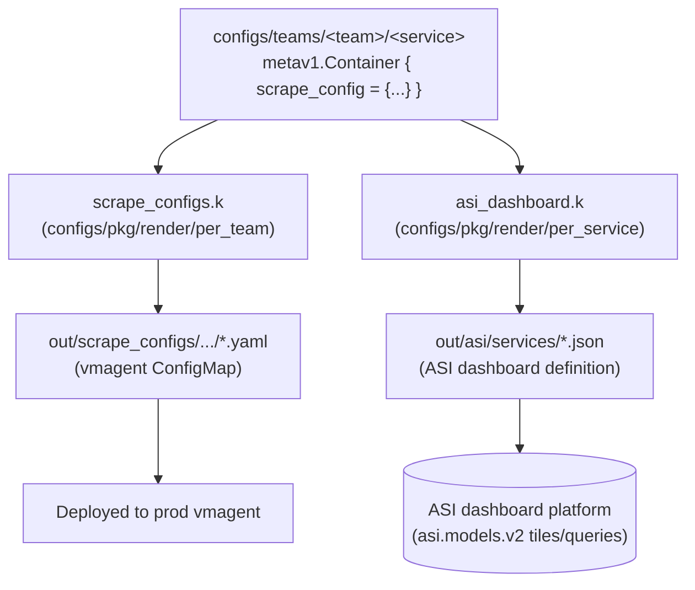
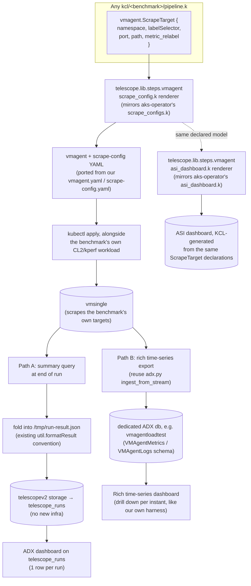

# Design: KCL-Native VMAgent Observability for Telescope V2

## Goal

Let **any** Telescope v2 benchmark (`kcl/<pipeline>/pipeline.k`) declare what it wants
scraped, get a real vmagent deployed against it automatically, and have the results land
in Kusto/dashboards — the same way aks-operator already generates its production scrape
configs and ASI dashboards from one declarative KCL model, instead of every benchmark
hand-rolling its own metrics collection in bash.

## 1. Telescope v2 today

v2 pipelines are pure orchestration: KCL composes reusable steps (cluster create, CL2/kperf
run, collect result) into ADO YAML. Observability is a single flat JSON blob per run —
there is no scraping, no time series, no per-target health.

```mermaid
flowchart LR
    subgraph Author["kcl/&lt;pipeline&gt;/pipeline.k"]
        A1["azure.Login / CreateResourceGroup"]
        A2["azure.AzCli: create cluster"]
        A3["k8s.RunClusterLoader2 / kperf.RunKperfBenchmark"]
        A4["azure.AzCli: collect result &rarr; /tmp/run-result.json"]
        A5["common.UploadResult"]
    end

    A1 --> A2 --> A3 --> A4 --> A5
    A5 -->|blob upload| Storage[("telescopev2 storage account\ncontainer: aks")]
    Storage -->|auto data connection| Kusto[("telescopev2.westus2.kusto.windows.net\ndb: aks, table: telescope_runs")]
    Kusto --> Dash["ADX Dashboard\n(one row per run, `result` dynamic column)"]
```

**Limitation:** `telescope_runs` is one row per run. It can hold a handful of scalar
fields (`result.my_metric_s`) but not a Prometheus-style time series, and nothing scrapes
the workload under test while it runs — you only get whatever the benchmark's own bash
step decided to compute at the very end.

## 2. The pattern aks-operator already proved: one declarative model, many renderers

aks-operator does not hand-write scrape configs or dashboards per team. Every
`Team → Service → Container` is a KCL schema instance, and each container optionally
declares a `scrape_config` and/or is picked up by dashboard projections. Independent
renderers then walk the *same* object graph to produce different outputs:

Key file references: [scrape_configs.k](aks-operator/manifests/configs/pkg/render/per_team/scrape_configs.k) (`yaml.dump_to_file([c.scrape_config], ...)` for every registered container) and [asi_dashboard.k](aks-operator/manifests/configs/pkg/render/per_service/asi_dashboard.k) (`projections.ServiceDashboards(svc, svc.containers).asi_dashboard` for every registered service). Neither renderer knows about the other — they just both read the same declared model.

## 3. Proposed design: bring that pattern into telescope v2

Add a small, generic KCL schema + renderer library (mirrors #2 exactly, generalized
away from "AKS production team" to "any v2 benchmark"), plus a thin Python exporter
reused from our own [adx.py](telescope/modules/python/vmagent_loadtest/adx.py).

The important idea: the **same** `vmagent.ScrapeTarget` declarations a benchmark author
writes once feed *three* things — the scrape-config manifest, the ADX summary/time-series
export, and (optionally) a KCL-generated ASI dashboard — exactly the "one model, many
renderers" shape aks-operator already uses in production.

## 4. Pros and cons of the new design

| | Detail |
|---|---|
| ✅ **Reuses a proven pattern** | Not inventing new KCL idioms — directly mirrors aks-operator's `scrape_configs.k` / `asi_dashboard.k` split, which is already battle-tested in prod. |
| ✅ **Every v2 benchmark gets real scrape data for free** | Today only end-of-run bash math; with this, any team's `pipeline.k` can attach real per-target scrape health, latency, error rates during the run — not just a final summary. |
| ✅ **Path A needs zero new infrastructure** | Folding a vmsingle summary into the existing `run-result.json` plugs directly into `telescope_runs` / existing ADX dashboards — no new storage, no new Kusto db, no new auth to configure. |
| ✅ **Path B is available when fidelity matters** | Teams that need real drill-down (like our own konnectivity/vmagent harness) can opt into the richer ingestion without forcing it on every simple benchmark. |
| ✅ **Single source of truth** | One `ScrapeTarget` declaration in `pipeline.k` drives manifest + export + dashboard — can't drift out of sync the way hand-maintained bash + hand-maintained dashboard queries can. |
| ⚠️ **Two ADX shapes to maintain** | Path A (flat JSON row) and Path B (multi-table time series) are genuinely different data models; documentation/tooling has to make clear which one a given benchmark is using. |
| ⚠️ **New library surface to build and own** | `kcl/lib/steps/vmagent/*.k` doesn't exist yet — this is new code (schema + two renderers + Python exporter), not just wiring existing pieces together. |
| ⚠️ **vmagent/vmsingle deploy cost per benchmark** | Every opted-in pipeline now also deploys vmagent+vmsingle and waits for them to be ready — extra pipeline time and cluster resources versus today's "just run CL2/kperf" model. |
| ⚠️ **Path B requires per-team Kusto access** | A dedicated ADX db (or a shared one) needs its own auth/permissions story distinct from the `telescopev2`/`aks` blob-storage convention every v2 pipeline already gets for free. |
| ⚠️ **KCL-generated ASI dashboards are a new integration** | aks-operator's ASI renderer targets AKS's own service/team registry; reusing `asi.models.v2` for arbitrary benchmarks means defining what "team/service" even means for a one-off load test. |
| ⚠️ **Scope creep risk** | It's tempting to make the shared schema cover every possible scrape shape (ours has ~20 job types); keeping the v2 library's initial schema minimal (namespace + selector + port + path) is important to avoid rebuilding our whole `scrape-config.yaml` complexity as day-one scope. |

## 5. Suggested incremental path

1. Prototype the KCL schema + `scrape_config.k`-style renderer only (no pipeline wiring, no ADX) — validate it produces the same YAML shape our Python templating does today.
2. Wire Path A (summary-into-`run-result.json`) into one real v2 pipeline as a pilot — zero new infra, fastest to validate end-to-end.
3. Only build Path B (dedicated rich ADX ingestion) if a specific benchmark actually needs time-series drill-down, reusing `adx.py`'s ingest code rather than rewriting it.
4. Defer the KCL ASI-dashboard renderer until Path A/B are proven, since it depends on deciding how "team/service" maps onto ad-hoc benchmarks.
