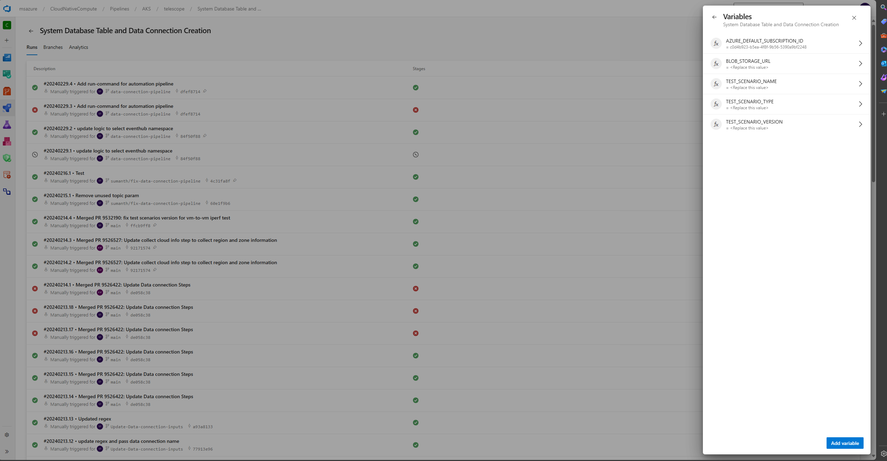
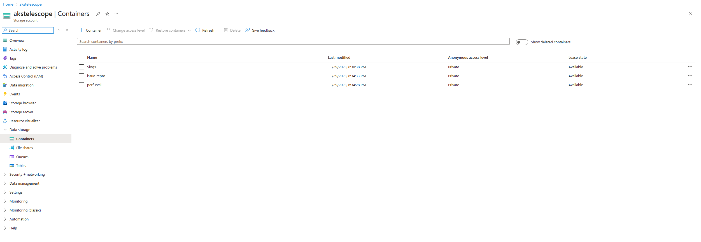
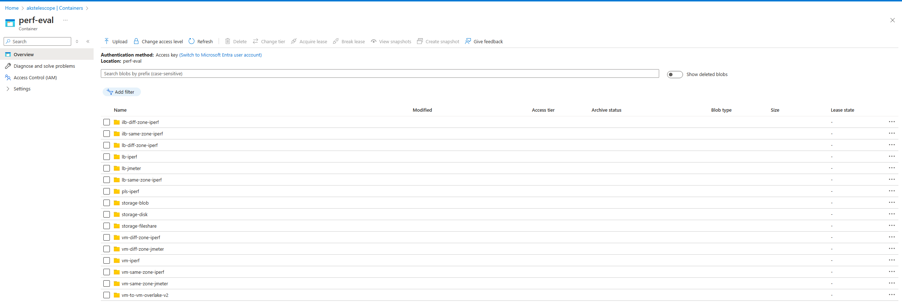
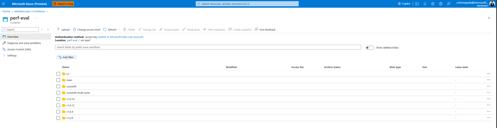
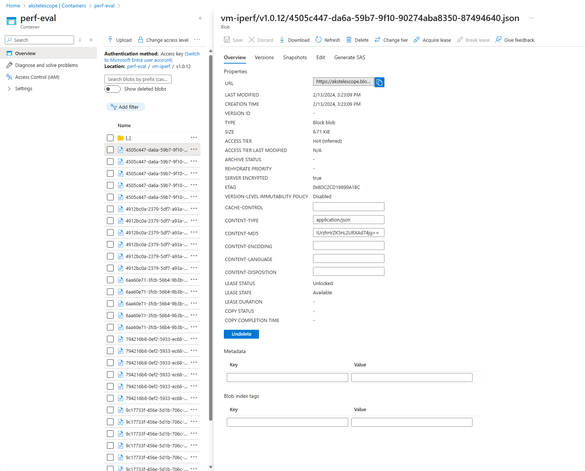
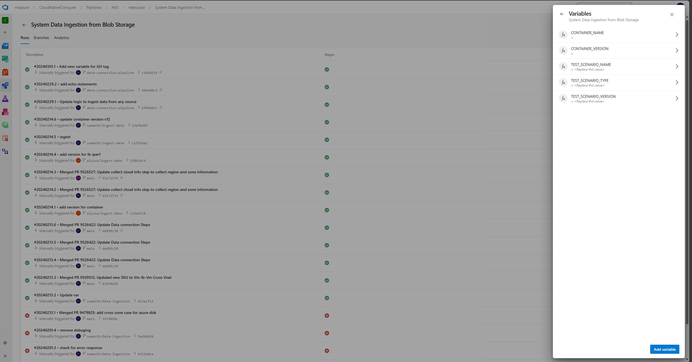

# Data connection and Data Ingestion Automation Pipelines

## Summary
You can use the following pipelines to create a new table for a given test scenario or perform one-time data ingestion from Azure Storage Container to an existing Kusto table

# System Database Table and Data Connection Creation:
Pipeline - [System Database Table and Data Connection Creation](https://msazure.visualstudio.com/CloudNativeCompute/_build?definitionId=342761&_a=summary)

Steps and inputs to run this pipeline:
- Go to the pipeline page.
- Select Run Pipeline button to run this pipeline.

- Update variables based on your test scenario

Example:

    - SCENARIO_TYPE: perf-eval
    - SCENARIO_NAME: vm-iperf
    - SCENARIO_VERSION: v.1.0.15
    - BLOB_STORAGE_URL:https://akstelescope.blob.core.windows.net/perf-eval/vm-iperf/v1.0.12/4505c447-da6a-59b7-9f10-90274aba8350-87494640.json

- Click on Run to create the data connections and tables based on the result data from storage account.

- [Successful pipeline run](https://msazure.visualstudio.com/CloudNativeCompute/_build/results?buildId=87481748&view=results)

# Steps to get Azure Blob Storage URL
- Go to [AKS Storage account](https://ms.portal.azure.com/#@microsoft.onmicrosoft.com/resource/subscriptions/c0d4b923-b5ea-4f8f-9b56-5390a9bf2248/resourceGroups/telescope/providers/Microsoft.Storage/storageAccounts/akstelescope/containersList)
- Select any container based on the scenario type.

- Select the scenario folder for which you want to create a table.

- Select folder based on scenario version you want to use for table creation.

- select any blob file and copy the URL

# System Data Ingestion from Blob Storage:

Pipeline -[System Data Ingestion from Blob Storage)](https://msazure.visualstudio.com/CloudNativeCompute/_build?definitionId=345697)

Steps and inputs to run this pipeline:
- Go to the pipeline page.
- Select Run Pipeline button to run this pipeline.

- Update variables based on your test scenario

Example:

    - SCENARIO_TYPE: perf-eval
    - SCENARIO_NAME: vm-iperf
    - SCENARIO_VERSION: v.1.0.15
    - CONTAINER_NAME:
    - CONTAINER_VERSION:

- Here CONTAINER_NAME & CONTAINER_VERSION are optional default empty variables.

# Scenario-1
    - SCENARIO_TYPE: perf-eval
    - SCENARIO_NAME: vm-iperf
    - SCENARIO_VERSION: v.1.0.15
    - CONTAINER_NAME: vm-iperf
    - CONTAINER_VERSION: v.1.0.10

- When we provide these inputs we will start ingesting data from *perf-eval/vm-iperf/v1.0.10* into vm_iperf_v_1_0_15 table.
- This scenario is useful when we want to ingest data from older version blob folders into newer version table.

# Scenario-2
    - SCENARIO_TYPE: perf-eval
    - SCENARIO_NAME: vm-iperf
    - SCENARIO_VERSION: v.1.0.15
    - CONTAINER_NAME:""
    - CONTAINER_VERSION:""

- When we provide these inputs we will start ingesting data from *perf-eval/vm-iperf/v1.0.15* into vm_iperf_v_1_0_15 table.

- [Successful pipeline run](https://msazure.visualstudio.com/CloudNativeCompute/_build/results?buildId=87483539&view=logs&j=36a08b4a-8fb0-5483-406c-cef72de14512&t=8680e7ae-c3d4-5dab-593a-979ba4750c3a)

### References
* [Azure Data Explorer](https://learn.microsoft.com/en-us/azure/data-explorer/data-explorer-overview)
* [Kusto Query Language](https://learn.microsoft.com/en-us/azure/data-explorer/kusto/query)
* [Azure Storage ](https://learn.microsoft.com/en-us/azure/storage/)
* [LightIngest Data into Kusto](https://learn.microsoft.com/en-us/azure/data-explorer/lightingest)
