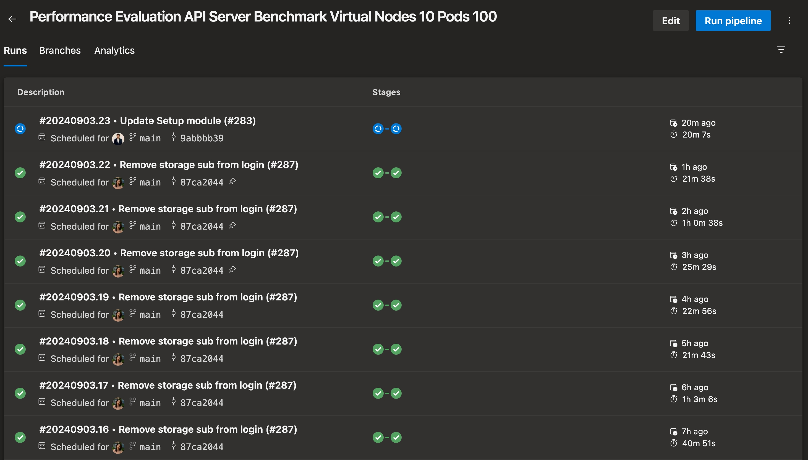
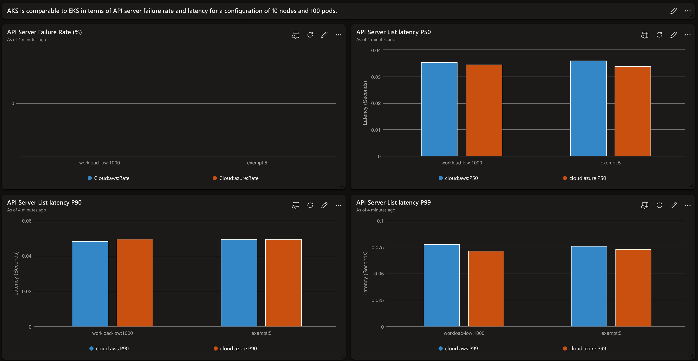

# Tooling and Setup

This folder contains Terraform modules for creating new infrastructure setup, pipelines, Data Connections, and Tables for Kusto databases.

For all modules, you need to have the following tools:

- Install [Terraform - 1.7.3](https://developer.hashicorp.com/terraform/tutorials/azure-get-started/install-cli)
- Install [Azure CLI - 2.57.0](https://learn.microsoft.com/en-us/cli/azure/install-azure-cli-linux?pivots=apt)
- Install [jq - 1.6-2.1ubuntu3](https://stedolan.github.io/jq/download/)
- Install [AWS CLI - 2.15.19](https://docs.aws.amazon.com/cli/latest/userguide/install-cliv2-linux.html)

## Test Pipeline

To verify changes to the test scenario, job, or just the pipeline, you can configure a test pipeline manually and run with a more controlled test. Please refer to the guidelines for each cloud provider:

- [AKS](../azure/README.md)
- [EKS](../aws/README.md)
- [GCP](../gcp/README.md)

With pipeline setup manually, you can uun pipeline or wait for scheduled run on Azure DevOps.
.

The [existing pipelines](../../../README.md) are hosted in Azure Devops.

After the test run, import [dashboard](../../../dashboards/example.json) and check test results on Azure Data Explorer:


## Production Pipeline

To run the full setup, set the follow environment variables:

```bash
export AZDO_PERSONAL_ACCESS_TOKEN=<Azure DevOps Personal Access Token>
export AZDO_ORG_SERVICE_URL=https://dev.azure.com/<Azure DevOps Org Name> # https://dev.azure.com/telescope
export AZDO_GITHUB_SERVICE_CONNECTION_PAT=<GitHub Personal Access Token>
export TF_VAR_resource_group_name=<Resource Group Name>
export TF_VAR_storage_account_name=<Storage Account Name>
export TF_VAR_kusto_cluster_name=<Kusto Cluster Name>
```

**`AZDO_PERSONAL_ACCESS_TOKEN`**

The ADO PAT token requires the follow permissions (click all settings at the bottom if you don't see all of the options):

- Agent Pools (Read & Manage)
- Build (Read & Execute)
- Pipeline Resources (Use & Manage)
- Service Connections (Read, Query & Manage)
- Variable Groups (Read, Create & Manage)
- Code (Read) - For pipeline setup, if the pipeline is in ADO repository

Run `make` to setup test framework. It will create all [resources](#infrastructure) required to run the experiments in Azure, AWS, and ADO.

```bash
az login
aws configure

# under directory ./modules/terraform/setup
make all 
```

## Modules

- [Infrastructure](./infrastructure/main.tf)
- [Pipeline](./pipeline/main.tf)
- [Table and Data Connection](./table-data-connections)
- [Data Ingestion](#data-ingestion)

### Infrastructure

This module creates the following resources:

- Resource Group
- Service Principal and grant owner access to the subscription
- Azure Data Explorer Cluster
- Azure Data Explorer Database
- Azure Event Hub Namespace
- Azure Storage Account
- Azure Storage Container
- Azure Service Connection
- AWS Service Connection
- AWS IAM User and Access Key's
- Azure DevOps Variable Groups

All the resources are created based on the input tfvars file which is located here [setup.tfvars](./infrastructure/setup.tfvars). Run `make infrastructure_setup` to setup infrastructure.

### Pipeline

Operations supported by this module:

- Create a new pipeline from the existing YAML file in Azure DevOps or GitHub
- Create new variables for the pipeline
- Attach/Link existing Variable Groups to the pipeline
- Authroize the pipeline to use the existing Service Connections listed in the tfvars file
- Authorize the pipeline to use the agent pool

This module creates a new pipeline in Azure DevOps based on the input tfvars file located here [pipeline.tfvars](./pipeline/pipeline.tfvars). Run `make pipeline_setup` to create the pipeline.

### Table and Data Connection

This module creates the following resources:

- Azure Data Explorer Table and Data Connection
- Event Hub Namespace, Event Hub  and Event Hub Subscription
- Consumer Group for Event Hub

All the resources are created based on the input tfvars file which is located here [table-data-connections.tfvars](./table-data-connections/table-data-connections.tfvars). Run `make table_dataconnection_setup` to create the kusto cluster and tables.

### Data Ingestion

This module will ingest data into the Azure Data Explorer Table created in the previous step. The data is ingested from azure storage account blob container to the Azure Data Explorer Table.

In addition, the module requires tools and variables:

**Kusto LightIngest** [Download v12.1.2](https://github.com/Azure/Kusto-Lightingest/releases/tag/12.1.2)

The variables can be extracted from previous run, and for now login to Azure Portal and locate the resources you created earlier:

```bash
KUSTO_CLUSTER_NAME=<Kusto Cluster Name> #$TF_VAR_kusto_cluster_name
KUSTO_CLUSTER_REGION=<Kusto Cluster Region> 
KUSTO_DATABASE_NAME=<Kusto Database Name> 
KUSTO_TABLE_NAME=<Kusto Table Name>
STORAGE_ACCOUNT_NAME=<Storage Account Name> #$TF_VAR_storage_account_name
STORAGE_CONTAINER_NAME=<Storage Container Name>
CONTAINER_PREFIX=<Container Prefix>
```

Run script `kusto-ingest.sh` to ingest data into the Kusto Table. The script will ingest data from the azure storage account blob container to the Kusto Table.

## References

- [Terraform AWS Provider](https://www.terraform.io/docs/providers/aws/index.html)
- [Terraform Azure Provider](https://www.terraform.io/docs/providers/azurerm/index.html)
- [Terraform Azure DevOps Provider](https://registry.terraform.io/providers/microsoft/azuredevops/latest/docs)
- [Azure CLI](https://docs.microsoft.com/en-us/cli/azure/install-azure-cli)
- [AWS CLI](https://docs.aws.amazon.com/cli/latest/)
- [Kusto LightIngest](https://learn.microsoft.com/en-us/azure/data-explorer/lightingest)
- [Make Utility](https://www.gnu.org/software/make/manual/make.html)
- [Azure DevOps Authentication Guide](https://registry.terraform.io/providers/microsoft/azuredevops/latest/docs/guides/authenticating_using_the_personal_access_token)
